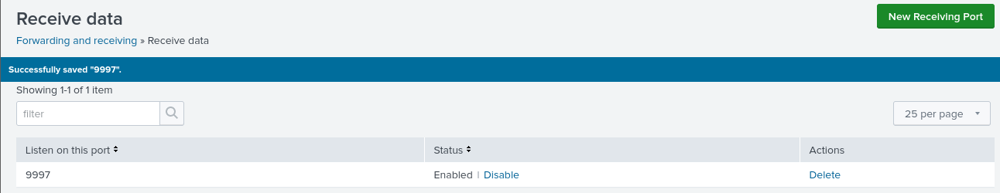

# Architecture
<!-- Defining the environment with wich we will be working with -->
## Environment
We are going to use NETinVM, a useful single VMware virtual machine that uses Linux as an operating system, runs Debian 10, and is able to virtualise a network topology divided into an external network (`exta`, `extb`, `extc`...), the perimeter network DMZ (`dmza`, `dmzb`, `dmzc`...), and the internal network (`inta`, `intb`, `intc`...). There is also a machine named `FW` that acts as the firewall, simulating a three-legged DMZ topology, and the machine `base`, which is the one we are when accessing the virtual machine that acts as a DNS server in the external network.
VM download: https://informatica.uv.es/~carlos/docencia/netinvm/#current-version-december-29-2022

<!-- Defining Roles -->
## Roles
The roles will be:
- Attacker: `exta`
- DMZ: `dmza`(Web Server+WAF+OSSEC), `dmzc`(OSSEC Server + Snort NIDS)
- Internal network: `inta`(OSSEC), `intb`(OSSEC), `intc`(Splunk)

With the defined roles, we now need to select the machines that we will be using. So we need to click on configure my machines, delete the launch parameters, and put these ones:
```
netinvm_run -E exta
netinvm_run -E fw
netinvm_run -E dmza
netinvm_run -E dmzc
netinvm_run -E inta
netinvm_run -E intb
netinvm_run -E intc
```

<div align="center">
  <a href="https://github.com/vectorete/siem-project-splunk-snort-ossec/GUIDE.md">
    
  </a>
</div>

> [!TIP]
> It could also be launched on different desktops. For example, launching exta in desktop 2 --> netinvm_run -d 2 exta

---
# Splunk Enterprise
## Initial Steps
We will start first downloading Splunk in `intc` in root mode that will be inside the internal network. 
> [Documentation](https://docs.splunk.com/Documentation/Splunk/9.3.0/Installation/Whatsinthismanual)

We need to [create an account](https://www.splunk.com/en_us/download/splunk-enterprise.html) on the Splunk website, and then we will need to download Splunk Enterprise.
```bash
wget -O splunk-9.3.1-0b8d769cb912-linux-2.6-amd64.deb "https://download.splunk.com/products/splunk/releases/9.3.1/linux/splunk-9.3.1-0b8d769cb912-linux-2.6-amd64.deb"
```

Then we need to download the Debian package, add permissions, and run in the shell in the same folder as the downloaded file:
```bash
chmod 755 splunk_package_name.deb
dpkg -i splunk_package_name.deb
```

Open the program:
``` bash
/opt/splunk/bin/splunk enable boot-start
```

The administrator username will be "admin" and the password "passpass".

> [!CAUTION]
> Notice that this is an insecure practice to use a generic admin name with a really obvious password; I'll be using it to not overcomplicate things and make this a demonstration of a working SIEM.

The splunk server will be running in 10.5.2.12:8000 by default.

Start splunk:
```bash
service splunk start
```

On the web server, navigate to 10.5.2.12:8000 to view the Splunk interface.
<div align="center">
  <a href="https://github.com/vectorete/siem-project-splunk-snort-ossec/GUIDE.md">
    
    <br>
    
  </a>
</div>

## Setting up data receiver
In the shell, we will enable a data receiver to receive data streams from the universal forwarders:
```bash
/opt/splunk/bin/splunk enable listen 9997 -auth admin:passpass
```
>[!IMPORTANT]
> These are my credentials; modify with whichever one you used

> [!NOTE]
> It can also be done in the graphical interface in the browser running Splunk service at settings>data>forwarding and receiving

<div align="center">
  <a href="https://github.com/vectorete/siem-project-splunk-snort-ossec/GUIDE.md">
    
    <br>
    
  </a>
</div>

## Splunk Applications
### Snort Application
Download the Snort app for Splunk in Apps > Find More Apps:
>[!IMPORTANT]
> Use your Splunk account credentials, not the local one

<div align="center">
  <a href="https://github.com/vectorete/siem-project-splunk-snort-ossec/GUIDE.md">
    
  </a>
</div>

### OSSEC Application
For OSSEC, download this old archived app: https://splunkbase.splunk.com/app/300.

Extract the tgz in /opt/splunk/etc/aps:
```bash
mv ossec_file.tgz /opt/splunk/etc/apps
cd /opt/splunk/etc/apps
tar zxf ossec_file.tgz
rm ossec_file.tgz
```
Restart Splunk to make the app appear:
```bash
/opt/splunk/bin/splunk restart
```
<div align="center">
  <a href="https://github.com/vectorete/siem-project-splunk-snort-ossec/GUIDE.md">
    
  </a>
</div>

>[!NOTE]
> The app doesn't have all the functionality available because it uses advanced XML, which was not supported in the last versions of Splunk, so it needs to be adapted, but we can still use some of them.

---
# OSSEC(HIDS) 
## Firewall (`FW`) Configuration
Before starting with the installation, we will need to allow the server communication, port 1514 (UDP), in the firewall, because if not, these internal network agents will not be able to establish a connection with the server. So in `FW` as root we will add these both forward chain iptables rules:
```bash
iptables -A FORWARD -p udp -s 10.5.2.0/24 --dport 1514 -j ACCEPT
iptables -A FORWARD -p udp -s 10.5.1.12 --sport 1514 -j ACCEPT
```
And we will make the changes persistent with:
```bash
iptables-save > /etc/iptables/rules.v4
```
## Initial Steps - Server Set Up (`dmzc`)
First we will install the OSSEC server in dmzc as root with the required dependencies:
```
wget https://github.com/ossec/ossec-hids/archive/3.7.0.tar.gz
apt update
apt install zlib1g-dev libpcre2-dev libevent-dev libssl-dev libsystemd-dev
tar zxf ./3.7.0.tar.gz
cd ossec-hids-*
./install.sh
```

Now we have to specify that we want to install it in server mode with the rest of the options at default.
> [!TIP]
> We could also specify to receive the alerts in mail using user1@localhost through kmail; if we install and configure it. We will receive a mail informing that the server is operative after the installation.
```
 OSSEC HIDS v3.7.0 Installation Script - http://www.ossec.net
 
 You are about to start the installation process of the OSSEC HIDS.
 You must have a C compiler pre-installed in your system.
 
  - System: Linux dmzc 5.10.0-20-amd64
  - User: root
  - Host: dmzc


  -- Press ENTER to continue or Ctrl-C to abort. --


1- What kind of installation do you want (server, agent, local, hybrid or help)? server

  - Server installation chosen.

2- Setting up the installation environment.

 - Choose where to install the OSSEC HIDS [/var/ossec]: 

    - Installation will be made at  /var/ossec .

3- Configuring the OSSEC HIDS.

  3.1- Do you want e-mail notification? (y/n) [y]: y
   - What's your e-mail address? user1@localhost

   - We found your SMTP server as: 127.0.0.1
   - Do you want to use it? (y/n) [y]: y

   --- Using SMTP server:  127.0.0.1

  3.2- Do you want to run the integrity check daemon? (y/n) [y]: 

   - Running syscheck (integrity check daemon).

  3.3- Do you want to run the rootkit detection engine? (y/n) [y]: 

   - Running rootcheck (rootkit detection).

  3.4- Active response allows you to execute a specific 
       command based on the events received. For example,
       you can block an IP address or disable access for
       a specific user.  
       More information at:
       http://www.ossec.net/docs/docs/manual/ar/index.html
       
   - Do you want to enable active response? (y/n) [y]: 

     - Active response enabled.
   
   - By default, we can enable the host-deny and the 
     firewall-drop responses. The first one will add
     a host to the /etc/hosts.deny and the second one
     will block the host on iptables (if linux) or on
     ipfilter (if Solaris, FreeBSD or NetBSD).
   - They can be used to stop SSHD brute force scans, 
     portscans and some other forms of attacks. You can 
     also add them to block on snort events, for example.

   - Do you want to enable the firewall-drop response? (y/n) [y]: 

     - firewall-drop enabled (local) for levels >= 6

   - 
      - 10.5.1.1

   - Do you want to add more IPs to the white list? (y/n)? [n]: 

  3.5- Do you want to enable remote syslog (port 514 udp)? (y/n) [y]: 

   - Remote syslog enabled.

  3.6- Setting the configuration to analyze the following logs:
    -- /var/log/messages
    -- /var/log/auth.log
    -- /var/log/syslog
    -- /var/log/dpkg.log
    -- /var/log/apache2/error.log (apache log)
    -- /var/log/apache2/access.log (apache log)

 - If you want to monitor any other file, just change 
   the ossec.conf and add a new localfile entry.
   Any questions about the configuration can be answered
   by visiting us online at http://www.ossec.net .
```
Then we will need to start the OSSEC server:
```bash
systemctl start ossec
```
>[!TIP]
> If you want to check server status, you can do it with --> systemctl status ossec

## Intitial Steps - Agent Set Up (`dmza`, `inta`, `intb`)
Now it's time to install in the rest of the machines(`dmza`, `inta`, `intb`) in agent mode (e.g., `inta`):
```bash
wget https://github.com/ossec/ossec-hids/archive/3.7.0.tar.gz
apt update
apt install zlib1g-dev libpcre2-dev libevent-dev libssl-dev libsystemd-dev
tar zxf ./3.7.0.tar.gz
cd ossec-hids-*
./install.sh
```

```
 OSSEC HIDS v3.7.0 Installation Script - http://www.ossec.net
 
 You are about to start the installation process of the OSSEC HIDS.
 You must have a C compiler pre-installed in your system.
 
  - System: Linux inta 5.10.0-20-amd64
  - User: root
  - Host: inta


  -- Press ENTER to continue or Ctrl-C to abort. --


1- What kind of installation do you want (server, agent, local, hybrid or help)? agent

  - Agent(client) installation chosen.

2- Setting up the installation environment.

 - Choose where to install the OSSEC HIDS [/var/ossec]: 

    - Installation will be made at  /var/ossec .

3- Configuring the OSSEC HIDS.

  3.1- What's the IP Address or hostname of the OSSEC HIDS server?: 10.5.1.12

   - Adding Server IP 10.5.1.12

  3.2- Do you want to run the integrity check daemon? (y/n) [y]: y

   - Running syscheck (integrity check daemon).

  3.3- Do you want to run the rootkit detection engine? (y/n) [y]: y

   - Running rootcheck (rootkit detection).

  3.4 - Do you want to enable active response? (y/n) [y]: y


  3.5- Setting the configuration to analyze the following logs:
    -- /var/log/messages
    -- /var/log/auth.log
    -- /var/log/syslog
    -- /var/log/dpkg.log
    -- /var/log/apache2/error.log (apache log)
    -- /var/log/apache2/access.log (apache log)

 - If you want to monitor any other file, just change 
   the ossec.conf and add a new localfile entry.
   Any questions about the configuration can be answered
   by visiting us online at http://www.ossec.net .
   
   
   --- Press ENTER to continue ---
```

## Configuring agents in the server (`dmzc`)
### Adding agents to the server
As the agents will be reporting it to the server through a secure encrypted and authenticated channel, we will need to export an authentication key for each client (from the server) that we will need to import for each one of them (import the respective key for each secured machine).

* In the server(`dmzc`) for each client (e.g., `inta`)
First we add the agent that will be id 001 (the first one to be configured; the next will be 002), the name will be the same as the machine, and the IP with the respective IP.
```bash
/var/ossec/bin/manage_agents 
```

```
**************************************** 
* OSSEC HIDS v1.1 Agent manager.       * 
* The following options are available: * 
**************************************** 
   (A)dd an agent (A). 
   (E)xtract key for an agent (E). 
   (L)ist already added agents (L). 
   (R)emove an agent (R). 
   (Q)uit. 
Choose your action: A,E,L,R or Q: a 
 - Adding a new agent (use '\q' to return to main menu). 
  Please provide the following: 
    * A name for the new agent: inta 
    * The IP Address for the new agent: 10.5.2.10 
    * An ID for the new agent[002]: 
Agent information: 
    ID:002
    Name:inta 
    IP Address:10.5.2.10 
 
Confirm adding it?(y/n): y 
Added. 
```

### Extracting key for each agent, from the server
Now we will export the key in the respective option at `dmzc`:

```bash
/var/ossec/bin/manage_agents 
```

```
**************************************** 
* OSSEC HIDS v1.1 Agent manager.       * 
* The following options are available: * 
**************************************** 
   (A)dd an agent (A). 
   (E)xtract key for an agent (E). 
   (L)ist already added agents (L). 
   (R)emove an agent (R). 
   (Q)uit. 
Choose your actions: A,E,L,R or Q: e 
 
Available agents: 
    ID: 002, Name: inta, IP: 10.5.2.10 
Provide the ID of the agent you want to extract the key: 002 
 
Agent key information for '002' is: 
(copy this key)
 
** Press ENTER to return to the main menu. 
```

### Importing the respective key, from the server, for each agent (`dmza`, `inta`, `intb`)
In the agent that we will be configuring (e.g., `inta`):

> [!IMPORTANT]
> `inta`, `intb`, `intc`, `dmza` will have different keys and a different agent created in the server, so copy it and do the same procedure.

```bash
/var/ossec/bin/manage_agents 
```

```
**************************************** 
* OSSEC HIDS v1.1 Agent manager.       * 
* The following options are available: * 
**************************************** 
   (I)mport key for the server (I). 
   (Q)uit. 
   Choose your actions: I or Q: i 
 
* Provide the Key generated from the server. 
* The best approach is to cut and paste it. 
*** OBS: Do not include spaces or new lines. 
 
Paste it here: 
(your generated key)
 
Agent information: 
    ID:002 
    Name:inta 
    IP Address:10.5.2.10 
 
Confirm adding it?(y/n): y 
Added. 
** Press ENTER to return to the main menu.
```
Start each agent, after importing the key, with:
```bash
systemctl start ossec
```
## Final Server Set Up
### Verifying if it's functioning properly
After starting each agent's machine, restart the OSSEC server in `dmzc`:
```bash
systemctl restart ossec
```

Continue after OSSEC has been installed on all of the required PCs. Check it with:
```bash
/var/ossec/bin/agent_control 
```
Each agent should be appearing there.
<div align="center">
  <a href="https://github.com/vectorete/siem-project-splunk-snort-ossec/GUIDE.md">
    
  </a>
</div>

### Configuring active response
Now you can change the active response config in OSSEC with:
```bash
nano /var/ossecs/etc/ossec.conf
```
<div align="center">
  <a href="https://github.com/vectorete/siem-project-splunk-snort-ossec/GUIDE.md">
    
  </a>
</div>

You can change the level of severity of the alert at which each active response occurs, as well as the timeout.

> [!NOTE]
> You can check the documentation for further information: https://documentation.wazuh.com/current/user-manual/reference/ossec-conf/index.html

> [!WARNING]
> If you change the configuration, restart the server (`dmzc`) to reflect the changes -> systemctl restart ossec

---
# Snort(NIDS)
## Forwarding traffic to `dmzc` with Snort NIDS
Now we are going to download Snort and configure it in `dmzc`. For that, we will need to mirror all external network traffic directed to internal and DMZ networks, to the machine running Snort NIDS in `dmzc`.

> [!TIP]
> If it was a Cisco firewall, we only need to do this in the console:
Cisco_device#configure terminal<br>
Cisco_device(config)#monitor session 1 source interface external_interfacex/x<br>
Cisco_device(config)#monitor session 1 destination interface our_interfacex/x<br>

Our fictional network uses `FW`, a virtual machine, as a firewall to forward traffic with IPTABLES.

**We have two options:**

### - First Option
#### Firewall (`FW`) Set Up
We will be configuring the `FW` machine to forward all traffic from the external network.

> [!CAUTION]
> Be aware, that, if a script is being executed in a machine, the lateral movement is unrestricted but is easier to configure this way.

Now with IPTABLES, in `FW` machine as root, we can configure, that, for each packet coming from the external network (interface eth0), a copy of the packet is sent to `dmzc` (NIDS with Snort):

```bash
iptables -t mangle -A PREROUTING -i eth0 -j TEE --gateway 10.5.1.12
iptables-save > /etc/iptables/rules.v4
```
#### Server (`dmzc`) Set Up
In `dmzc`, set the interface in promiscuous mode to accept all traffic:

```bash
ip link set dev eth0 promisc on
```

Check that the flag is activated with:
```bash
ip addr show eth0
```
<div align="center">
  <a href="https://github.com/vectorete/siem-project-splunk-snort-ossec/GUIDE.md">
    
  </a>
</div>

Disable the network optimisations to avoid interferences:
```bash
ethtool -K eth0 gro off lro off
```

### - Second Option
#### Attaching interfaces to `dmzc` in `base`
We will be ataching two mirrored interfaces to forward all traffic from the DMZ switch and the internal switch, to the `dmzc` where Snort will be executed.

>[!CAUTION]
> The problem is that is somewhat harder to set up. But is more precise as we get to see all the communication in our network.

In `base` with user1, execute this to attach two interfaces to `dmzc`:
> [!NOTE]
> `base` is the start up machine

```bash
virsh attach-interface dmzc --type network --source dmz --target capture-nids1 --model virtio --config
virsh attach-interface dmzc --type network --source dmz --target capture-nids2 --model virtio --config
```
#### Configuring the new interfaces in `dmzc`
In `dmzc`, set the interface in promiscuous mode to accept all traffic:
```bash
ip link set dev eth1 promisc on
ip link set dev eth2 promisc on
```

Check that the flag is activated with:
```bash
ip addr show eth1
ip addr show eth2
```

<div align="center">
  <a href="https://github.com/vectorete/siem-project-splunk-snort-ossec/GUIDE.md">
    
  </a>
</div>

Set up the new interface:
```bash
ip link set dev eth1 up
ip link set dev eth2 up
```

Disable the network optimisations to avoid interferences:
```bash
ethtool -K eth1 gro off lro off
ethtool -K eth2 gro off lro off
```

In `base` as root:
```bash
ovs-vsctl --id=@p get port capture-nids1 --  --id=@m create mirror name=nids-int select-all=true output-port=@p -- add bridge virbr-int mirrors @m
ovs-vsctl --id=@p get port capture-nids2 --  --id=@m create mirror name=nids-dmz select-all=true output-port=@p -- add bridge virbr-dmz mirrors @m
```

We can check the results with Tcpdump or Wireshark and generate traffic to see if the copies are being generated. In my case, I checked it pinging from `extb`(10.5.0.11) to `inta`(10.5.2.10), and I was receiving a copy when monitoring the `dmzc` interface with Wireshark:
<div align="center">
  <a href="https://github.com/vectorete/siem-project-splunk-snort-ossec/GUIDE.md">
    
  </a>
</div>

## Snort Set Up
### Snort Installation
Then we can start installing Snort in `dmzc`:
```bash
su -
You can change me. 
apt-get update
```

> [!NOTE]
> If you didn't changed the password, of the machine in NetinVM, the password is "You can change me."

Dependencies that we need:
- cmake to build from source
- The Snort 3 libdaq for packet IO
- dnet for network utility functions
- flex >= 2.6.0 for JavaScript syntax parsing
- g++ >= 5 or other C++14 compiler
- hwloc for CPU affinity management
- LuaJIT for configuration and scripting
- OpenSSL for SHA and MD5 file signatures, the protected_content rule option, and SSL service detection
- pcap for tcpdump style logging
- pcre for regular expression pattern matching
- pkgconfig to locate build dependencies
- zlib for decompression

Installation:
```bash
sudo apt-get install -y \
    build-essential \
    libpcap-dev \
    libpcre3-dev \
    libnet1-dev \
    zlib1g-dev \
    luajit \
    hwloc \
    libdumbnet-dev \
    bison \
    flex \
    liblzma-dev \
    openssl \
    libssl-dev \
    pkg-config \
    libhwloc-dev \
    cmake \
    cpputest \
    libsqlite3-dev \
    uuid-dev \
    libcmocka-dev \
    libnetfilter-queue-dev \
    libmnl-dev \
    autotools-dev \
    libluajit-5.1-dev \
    libunwind-dev \
    libfl-dev
```
Now we download [gperftools](https://github.com/gperftools/gperftools):
```bash
cd ~
wget https://github.com/gperftools/gperftools/releases/download/gperftools-2.15/gperftools-2.15.tar.gz
```

Extract it and move inside the new folder:
```bash
tar xzf gperftools-*.tar.gz
cd gperftools-2.15
```
> [!NOTE]
> The folder name will depend on the gperftools version.

Compile and install it:
```bash
./configure
make
make install
```


Now the last one will be downloading libdaq for Snort 3:
> [List of products](https://www.snort.org/downloads#snort3-downloads)

```bash
wget https://api.github.com/repos/snort3/libdaq/tarball/v3.0.16
```

Extract it and move to the extracted folder:
```bash
tar xzf snort3-libdaq*.tar.gz
cd snort3-libdaq*
```

Now we have to configure it with:
```bash
./bootstrap
./configure
```
> [!NOTE]
> You should see a long output.

Finally install it with:
```bash
make
make install
```

Then we configure the runtime bindings:
```bash
ldconfig
```

Now it's time to get started with [Snort 3](https://www.snort.org/downloads#snort3-downloads):
```bash
cd ~
wget https://api.github.com/repos/snort3/snort3/tarball/3.3.4.0
```

Extract the file and navigate inside the extracted folder:
```bash
tar xzf snort3-snort3*.tar.gz
rm snort3-snort3*.tar.gz
cd snort3-snort3*
```

Configure it with:
```bash
./configure_cmake.sh --enable-tcmalloc
```

Install it:
```bash
cd build
make -j $(nproc)
make install
```

Add manually the path:
```bash
nano ~/.bashrc
```
At the end, add: ```export PATH=$PATH:/usr/local/snort/bin``` and apply the changes with:
```bash
source ~/.bashrc
```

Check if everything is alright with snort -V; you should see the version:
<div align="center">
  <a href="https://github.com/vectorete/siem-project-splunk-snort-ossec/GUIDE.md">
    
  </a>
</div>

Configure the ips that we will be monitoring with the file /usr/local/snort/etc/snort/snort.lua:
```bash
nano /usr/local/snort/etc/snort/snort.lua
```
Change the line that refers to internal network and the external network to: 
```
HOME_NET = [[10.5.1.0/24, 10.5.2.0/24]]
EXTERNAL_NET = '!$HOME_NET'´
```

Check the snort.lua config; there shouldn't be any warnings or errors:
```bash
snort -c /usr/local/snort/etc/snort/snort.lua
```

Then it's time to set up the rule files, where we will be making use of the community rules, which are a great addition to make the network safer, as it has constant support being updated to the actual standards.
> [Source](https://www.snort.org/downloads#snort3-downloads)

Create a folder for the rules. Move to that folder, and download the community rules:
```bash
mkdir /usr/local/snort/etc/snort/rules
cd /usr/local/snort/etc/snort/rules
```

Download the rules, extract them and delete the compressed file and the leftover folder; you don't need them anymore:
```bash
wget https://www.snort.org/downloads/community/snort3-community-rules.tar.gz
tar xzf snort3-community-rules.tar.gz
rm snort3-community-rules.tar.gz
mv ./snort3-community-rules/snort3-community.rules .
rm -r snort3-community-rules
```

Check the rules and make sure there is no error or warnings:
```bash
snort -c  /usr/local/snort/etc/snort/snort.lua -R /usr/local/snort/etc/snort/rules/snort3-community.rules
```
> [!TIP]
> It's important to constantly check the configuration and the rules, evertime you add custom rules or make changes.


In snort.lua as before, modify:
```
ips = 
{
    enable_builtin_rules = true,
    variables = default_variables,
    rules = [[
	include /usr/local/snort/etc/snort/rules/snort3-community.rules
    ]]
}
```
And in the seventh point, uncomment alert_full and have it like this:
```
alert_full { file = true }
```

---
##### Rules resources (Emerging threats by Proofpoint)
One of the best rules resources are the [emerging threats](https://rules.emergingthreats.net). The rules are compatible with different software, including NIDS/NIPS (like Suricata and Snort) and firewalls (such as iptables, PF, PIX, and IPF). Sadly the Snort rules, are from Snort 2.9 and will require to be adapted to the new format.

We could try to convert the older snort rules (in.rules) to the newer ones (out.rules) with:
```
snort2lua -c in.rules -r out.rules
```
---

> [!IMPORTANT]
>This command fixed me some issues while executing snort:<br>
```snort --daq-batch-size 1```

### Starting Snort Execution
Now we can finally start Snort:
* Option 1:
```bash 
snort -c /usr/local/snort/etc/snort/snort.lua -R /usr/local/snort/etc/snort/rules/snort3-community.rules -i eth0 -A alert_fast -s 65535 -k none
```
* Option 2:
> [!WARNING]
> We will be monitoring, for now, only one interface because Snort doesn't accept multiple interfaces; but we could create a process for each interface.
```bash
snort -c /usr/local/snort/etc/snort/snort.lua -R /usr/local/snort/etc/snort/rules/snort3-community.rules -i eth2 -A alert_fast -s 65535 -k none
```

---
We could test the NIDS with a new rule file `myrules.rules` with this rule:

```
alert icmp (msg:"ICMP connection test"; sid: 1343; rev:1)
```

> [!NOTE]
> Just create a new file in the same folder and add that rule file to snort.lua

```bash
snort -c /usr/local/snort/etc/snort/snort.lua -R /usr/local/snort/etc/snort/rules/myrules.rules -i {interface} -A alert_fast -s 65535 -k none
```

We can see how alerts are received each time there is a ping in the network.
<div align="center">
  <a href="https://github.com/vectorete/siem-project-splunk-snort-ossec/GUIDE.md">
    
  </a>
</div>

### Configure Snort as a daemon to start at boot
To make the changes persist after rebooting, we will create a daemon with systemd for the network interface configuration and run snort also with these parameters:
* Daemon NIC
	```
  nano /etc/systemd/system/snort-nic.service
  ```
- Put inside the new file:
  - First option:
  ```
  [Unit]
  Description=Put the NIC in promiscuous modes, disables GRO and LRO on boot for Snort
  After=network.target

  [Service]
  Type=oneshot
  ExecStart=/usr/sbin/ip link set dev eth0 promisc on
  ExecStart=/usr/sbin/ethtool -K eth0 gro off lro off
  TimeoutStartSec=0
  RemainAfterExit=yes

  [Install]
  WantedBy=default.target
  ```

  - Second option:
  ```
  [Unit]
  Description=Put the NIC in promiscuous, disables GRO, LRO on boot for Snort
  After=network.target

  [Service]
  Type=oneshot
  ExecStart=/usr/sbin/ip link set dev eth1 promisc on
  ExecStart=/usr/sbin/ethtool -K eth1 gro off lro off
  ExecStart=/usr/sbin/ip link set dev eth2 promisc on
  ExecStart=/usr/sbin/ethtool -K eth2 gro off lro off
  TimeoutStartSec=0
  RemainAfterExit=yes

  [Install]
  WantedBy=default.target
  ```

Save the file and reload the systemd daemon:
```
systemctl daemon-reload
```
Start the service with:
```
systemctl start snort-nic.service
systemctl enable snort-nic.service
```

Check the status with:
```
systemctl status snort-nic.service
```

* Daemon Snort
  - First option:
    ```
    nano /etc/systemd/system/snort-nids.service
    ```
    Put inside the new file:
    ```
    [Unit]
    Description=Snort Daemon
    After=syslog.target network.target

    [Service]
    Type=simple
    ExecStart=/usr/local/snort/bin/snort -c /usr/local/snort/etc/snort/snort.lua -s 65535 -k none -l /var/log/snort -D -i eth0 -m 0x1b -u root -g root
    ExecStop=/bin/kill -9 $MAINPID

    [Install]
    WantedBy=multi-user.target
    ```
  - Second option(we will run two snort instance for each interface).

    For the first interface:
    ```
    nano /etc/systemd/system/snort-nids-int.service
    ```
    Put inside the new file:
    ```
    [Unit]
    Description=Snort Daemon
    After=syslog.target network.target

    [Service]
    Type=simple
    ExecStart=/usr/local/snort/bin/snort -c /usr/local/snort/etc/snort/snort.lua -s 65535 -k none -l /var/log/snort -D -i eth1 -m 0x1b -u root -g root
    ExecStop=/bin/kill -9 $MAINPID

    [Install]
    WantedBy=multi-user.target
    ```
    For the second interface:
    ```
    nano /etc/systemd/system/snort-nids-dmz.service
    ```
    Put inside the new file:
    ```
    [Unit]
    Description=Snort Daemon
    After=syslog.target network.target

    [Service]
    Type=simple
    ExecStart=/usr/local/snort/bin/snort -c /usr/local/snort/etc/snort/snort.lua -s 65535 -k none -l /var/log/snort -D -i eth2 -m 0x1b -u root -g root
    ExecStop=/bin/kill -9 $MAINPID

    [Install]
    WantedBy=multi-user.target
    ```
Save the file and reload the systemd daemon:
```
systemctl daemon-reload
```

Start the service with:
```
systemctl enable --now snort-nids.service
```

Check the status with:
```
systemctl status snort-nids.service
```

> [!IMPORTANT]
> If you choose the second option, you need to do the previous command for each daemon listening in a different interface.

---
#### Snort Improvements 
##### PulledPork3
You can also make use of [PulledPork3](https://github.com/shirkdog/pulledpork3) for improved Snort3 rule management.
Their github is decently explained on how to install it (you will need Python 3). 
With that, you can easily use the emerging threat rules, which shows the [documentation](https://rules.emergingthreats.net/OPEN_download_instructions.html) that with `rule_url=https://rules.emergingthreats.net/|emerging.rules.tar.gz|open` the rules will be processed in PulledPork3.

As root on `dmzc` clone PulledPork3 github:
```bash
git clone https://github.com/shirkdog/pulledpork3.git
```

Install the next dependencies:
```bash
apt install perl
perl -MCPAN -e 'install Crypt::SSLeay'
perl -MCPAN -e 'install LWP::Simple'
perl -MCPAN -e 'install Bytes::Random::Secure'
perl -MCPAN -e 'install Switch'
```

For Python 3:
```bash
apt install build-essential zlib1g-dev libncurses5-dev libgdbm-dev libnss3-dev libssl-dev libreadline-dev libffi-dev libsqlite3-dev wget libbz2-dev
apt install python3 -y
```

Copy the necessary files to /usr/local/etc/pulledpork p.e:
```bash
mkdir /usr/local/etc/pulledpork/
cp ./etc/pulledpork.conf /usr/local/etc/pulledpork/
```

Also to /usr/local/bin/pulledpork:
```bash
mkdir /usr/local/bin/pulledpork/
chmod +x ./pulledpork.py
cp ./pulledpork.py /usr/local/bin/pulledpork/
cp -r lib/ /usr/local/bin/pulledpork/
```

Verify the installation with:
```bash
/usr/local/bin/pulledpork/pulledpork.py -V
```

You should see something similar to:
```
    https://github.com/shirkdog/pulledpork3
      _____ ____
     `----,\\    )    PulledPork v3.0.0.5
      `--==\\\\  /    Lowcountry yellow mustard bbq sauce is the best bbq sauce. Fight me.
       `--==\\\\/
     .-~~~~-.Y|\\\\_  Copyright (C) 2021 Noah Dietrich, Colin Grady, Michael Shirk
  @_/        /  66\\_  and the PulledPork Team!
    |    \\   \\   _(\")
     \\   /-| ||'--'   Rules give me wings!
      \\_\\  \\_\\\\
~~~~~~~~~~~~~~~~~~~~~~~~~~~~~~~~~~~~~~~~~~~~~~~~~~~~~~~~~~~~~~
```

Now, modify the pulledpork.conf file:
```bash
nano /usr/local/etc/pulledpork/pulledpork.conf
```

Choose the rule that best suits you. I will be using the non-registered community rules:
```
 community_ruleset = true
 registered_ruleset = false
 LightSPD_ruleset = false
```
>[!WARNING]
> If you are registered, set the oinkcode to be able to use LightSPD_ruleset.

If you want blocklists, set them to true as you see fit:
```
 snort_blocklist = true
 et_blocklist = true
```

Now set the correct paths:
```
 snort_path = /usr/local/snort/bin/snort
 local_rules = /usr/local/snort/etc/snort/rules/myrules.rules
```
>[!NOTE] 
> Local rules are your own rules, if you want to add some custom rules.

>[!TIP]
> You can also add `rule_url=https://rules.emergingthreats.net/|emerging.rules.tar.gz|open`, to make use ofthe emerging threat rules.

Run PulledPork3 and save the new rules wherever you want, p.e., where the Snort rules are:
```bash
/usr/local/bin/pulledpork/pulledpork.py -c /usr/local/etc/pulledpork3/pulledpork.conf -K /usr/local/snort/etc/snort/rules/
```

It will generate new pulledpork rules, so modify the configuration file snort.lua to use these improved rules:
```
ips = 
{
    enable_builtin_rules = true,
    variables = default_variables,
    include = /usr/local/snort/etc/snort/rules/pulledpork.rules
}
```

Also, we need to include the compiled .so rules that the pulledpork.rules need, so to not trigger an error, add this parameter to include these files `--plugin-path /usr/local/etc/so_rules/`:
```bash
snort-c /usr/local/etc/snort/snort.lua --plugin-path /usr/local/etc/so_rules
```
 
If you want to run it at start to constantly update it at boot:
```bash
nano /etc/systemd/system/pulledpork.service
```

```
 [Unit]
 Description=Run PulledPork3 to update Snort Rulesets at boot
 [Service]
 Type=oneshot
 ExecStart=/usr/local/bin/pulledpork/pulledpork.py -c /usr/local/etc/pulledpork3/pulledpork.conf -K /usr/local/snort/etc/snort/rules/
 [Install]
 WantedBy=multi-user.target
```

Enable and start it:
```bash
systemctl enable pulledpork
service pulledpork start
```

Also edit the previous Snort daemon with the new parameter and to wait until PulledPork3 ends the execution after booting: 
```bash
nano /etc/systemd/system/snort-nids.service
```
```
	[Unit]
	Description=Snort Daemon
	After=syslog.target network.target pulledpork.service

	[Service]
	Type=simple
	ExecStart=/usr/local/snort/bin/snort -c /usr/local/snort/etc/snort/snort.lua --plugin-path /usr/local/etc/so_rules -s 65535 -k none -l /var/log/snort -D -i eth0 -m 0x1b -u root -g root
	ExecStop=/bin/kill -9 $MAINPID

	[Install]
	WantedBy=multi-user.target
```

> [!IMPORTANT]
> If you are monitoring other interfaces, having multiple daemons, edit them also.

##### OpenAppID
Too, we can make use of OpenAppID that allows Snort to detect network applications like Facebook, Reddit, X...
As root in `dmzc`, download OpenAppID:
```bash
wget https://www.snort.org/downloads/openappid/33380 -O OpenAppId.tgz
```

Move it to the system directory (p.e.):
```bash
mv ./OpenAppId.tgz /usr/local/lib
```

Extract it and remove the unextracted file:
```bash
cd /usr/local/lib
tar -xzvf OpenAppId.tgz
rm OpenAppId.tgz
```

Edit the snort configuration, modifying these lines to define the OpenAppID folder and to enable logging:
```bash
nano /usr/local/snort/etc/snort/snort.lua
```

```
appid =
{
    app_detector_dir = '/usr/local/lib',
    log_stats = true,

}
```

Now just execute Snort as usual.

---

# Splunk Universal Forward
We will need for each machine protected the Splunk Universal Forwarder to stream the data logs to the machine running the Splunk Enterprise Siem. 
> [Documentation](https://docs.splunk.com/Documentation/Forwarder/9.3.0/Forwarder/Abouttheuniversalforwarder)

## Firewall (`FW`) Set Up
Before starting in `FW` as root, we need to add another IPTABLES rule to allow log forwarding to the Splunk server:
```bash
iptables -A FORWARD -s 10.5.1.12 -d 10.5.2.12 -p tcp --dport 9997 -j ACCEPT
```

And we will make the changes persistent with:
```bash
iptables-save > /etc/iptables/rules.v4
```
## Splunk Forwarder Set Up
1. For starters, we will need to enter in the shell as root in `dmzc`; the password is in the text file passwords.txt in the desktop of the main machine, which is "You can change me.":
    ```bash
    su -
    Password: You can change me. (Unless you changed it.)
    ```

2. Now we need to create the Splunk user and group:
    ```bash
    useradd -m splunkfwd
    groupadd splunkfwd
    ```

3. Then we create $SPLUNK_HOME:
    ```bash
    export SPLUNK_HOME="/opt/splunkforwarder"
    mkdir $SPLUNK_HOME
    ```
> [!TIP]
> You can add environment variables to the shell, permanently, modifying `.bashrc` as we did in Snort.

4. Download Splunk Forwarder package from https://www.splunk.com/en_us/download/universal-forwarder.html:
    ```bash
    wget -O splunkforwarder-9.3.1-0b8d769cb912-linux-2.6-amd64.deb "https://download.splunk.com/products/universalforwarder/releases/9.3.1/linux/splunkforwarder-9.3.1-0b8d769cb912-linux-2.6-amd64.deb"
    ```

5. We move the package to $SPLUNK_HOME and install it:
    ```bash
    mv ./splunkforwarder_package_name.deb $SPLUNK_HOME
    cd $SPLUNK_HOME
    dpkg -i splunkforwarder_package_name.deb
    ```

6. We will also need to change the ownership of the Splunk directory:
    ```bash
    chown -R splunkfwd:splunkfwd $SPLUNK_HOME
    ```

7. Run it:
    ```
    $SPLUNK_HOME/bin/splunk start --accept-license
    ```

8. Now we have to send the data to the receiving indexer:
    ``` bash
    $SPLUNK_HOME/bin/splunk add forward-server ip_splunk_siem:port 
    ```
> [!NOTE]
> In my case the forward server is 10.5.2.12:9997

9. Next, we need to specify which files we want to forward to inputs.conf.
	Explanation of the configuration file `inputs.conf`:
    ```
	[monitor://<path to your log file>]
	disabled = false
	sourcetype = <sourcetype for your logs> (eg:snort_alert_full)
	source = snort
	index = <the type of index you want to assign>
    ```
	
* If we are only running OSSEC:
    ```bash
    $SPLUNK_HOME/bin/splunk add monitor /var/ossec/logs/alerts/alerts.log
    ```
	The configuration:
    ```
	[splunktcp://9997]
	connection_host = 10.5.2.12
	
	[monitor:///var/ossec/logs/alerts/alerts.log]
	disabled = false
	source_type = ossec
	source = ossec
	index = main
    ```

* If we are running SNORT and OSSEC:
    ```bash
    $SPLUNK_HOME/bin/splunk add monitor /var/log/snort/alert_full.txt 
    $SPLUNK_HOME/bin/splunk add monitor /var/ossec/logs/alerts/alerts.log
    ```
> [!IMPORTANT]
> If you are monitoring more than one interface, monitor each log file generated by each Snort instance inspecting traffic on a different interface.

    In the config file, it should look like this (add the extra fields):

    ```bash
    nano $SPLUNK_HOME/etc/apps/search/local/inputs.conf
    ```

    The configuration:
    ```
    [splunktcp://9997]
    connection_host = 10.5.2.12

    [monitor:///var/log/snort/alert_full.txt] (If you used two interfaces, you need two for each snort alert file.)
    disabled = false
    sourcetype = snort_alert_full
    source = snort
    index = main

    [monitor:///var/ossec/logs/alerts/alerts.log]
    disabled = false
    source_type = ossec_alerts
    source = ossec
    index = main
    ```

> [!WARNING]
> If you monitor more files, make sure to edit them to the correct parameters.

Now, restart Splunk Forwarder:

```bash
$SPLUNK_HOME/bin/splunk restart
```

---
# Apache Web Server(WAF) - ModSecurity
To secure our Apache Web Server in `inta`, host whatever you want. 
> [!TIP]
> You can host something like Damn Vulnerable Web Application, [DVWA](https://github.com/digininja/DVWA).

Download modsecurity version 2, which is an Apache module:
```bash
apt install libapache2-mod-security2
```
>[!NOTE]
> If you want to secure Nginx or IIS there is a newernModSecurity version for them; you can check their [github page](https://github.com/owasp-modsecurity/ModSecurity).

Create folders for the cache data:
```bash
mkdir /var/cache/modsecurity/tmp 
mkdir /var/cache/modsecurity/data 
```

Use the recommended configuration:
```bash
cat  /etc/modsecurity/modsecurity.conf-recommended > /etc/modsecurity/modsecurity.conf
```

In `modsecurity.conf`, set:
- `SecRuleEngine On`
- `SecTmpDir /var/cache/modsecurity/tmp`
- `SecDataDir /var/cache/modsecurity/data`
- `SecStatusEngine Off`

Check the config with:
```bash
apachectl -t
```

The OWASP CRS rules are automatically included after downloading, we can check the presence of the rules with:
```bash
dpkg --listfiles modsecurity-crs 
```

You can also read the documentation:
```bash
cat /usr/share/doc/modsecurity-crs/README.Debian 
```

<div align="center">
  <a href="https://github.com/vectorete/siem-project-splunk-snort-ossec/GUIDE.md">
    
  </a>
</div>

Restart apache:
```bash
systemctl restart apache2
```

We can now make a few tests with DVWA, which allows us to try multiple vulnerabilities:
- Cross Site Scripting (XSS):
	* Reflected XSS:
<div align="center">
    <a href="https://github.com/vectorete/siem-project-splunk-snort-ossec/GUIDE.md">
        
    </a>
</div>
	  	modsecurityxssblock.png
	* Stored XSS:
<div align="center">
    <a href="https://github.com/vectorete/siem-project-splunk-snort-ossec/GUIDE.md">
        
    </a>
</div>

> [!NOTE]
> I used as message for the XSS: `Hi<script>alert("Compromised")</script>`

- Command Injection(Using "ping 10.5.1.1; cat /etc/passwd"):
<div align="center">
    <a href="https://github.com/vectorete/siem-project-splunk-snort-ossec/GUIDE.md">
        
    </a>
</div>

> [!NOTE]
> I used as command for the command injection: `ping 10.5.1.1; cat /etc/passwd`

- SQL Injection:
	modsecuritysqlinjection.png

<div align="center">
    <a href="https://github.com/vectorete/siem-project-splunk-snort-ossec/GUIDE.md">
        
    </a>
</div>

> [!NOTE]
> I used as query for the SQL injection: ` 3' or 1=1 #`

We can see this logs popping up in the log file with:
```bash
tail -f /var/log/apache2/modsec_audit.log
```

To forward this file to Splunk Enterprise, we can use the same procedure with Splunk Universal Forwarder in `dmza`.

---
# Additional Tools
## Testing(TestmyNIDS) 
TestmyNIDS is a magnificent script that allows us to test the NIDS and the HIDS: https://github.com/3CORESec/testmynids.org

Download the script and add execution permissions, in whatever machine in the dmz network or internal network, to test what would happen if there were a malicious script being executed in a compromised machine:
```bash
curl -sSL https://raw.githubusercontent.com/3CORESec/testmynids.org/master/tmNIDS -o /tmp/tmNIDS && chmod +x /tmp/tmNIDS && /tmp/tmNID
```
Execute the script and choose whichever option you want to:
```bash
./tmNIDS
```
<div align="center">
    <a href="https://github.com/vectorete/siem-project-splunk-snort-ossec/GUIDE.md">
        
    </a>
</div>

## Extending Security Operations Center (Functionality) 
We could also use Splunk SOAR to orchestrate workflows to automate incident responses and analyze data tied to specific security events and incidents.
> [Download](https://www.splunk.com/en_us/download/soar-free-trial.html)

You can use the Splunk documentation to install it(It cannot be installed in Debian).
> [Documentation](https://docs.splunk.com/Documentation/SOARonprem/6.2.2/Install/InstallUnprivileged)

For the initial steps follow:
https://docs.splunk.com/Documentation/SOARonprem/latest/Install/Reference

And to combine it with Splunk Enterprise download the app "Splunk App for SOAR Export", there is a guide:
https://docs.splunk.com/Documentation/SOARApp/1.0.67/Install/UnderstandSplunkAppforSOAR
