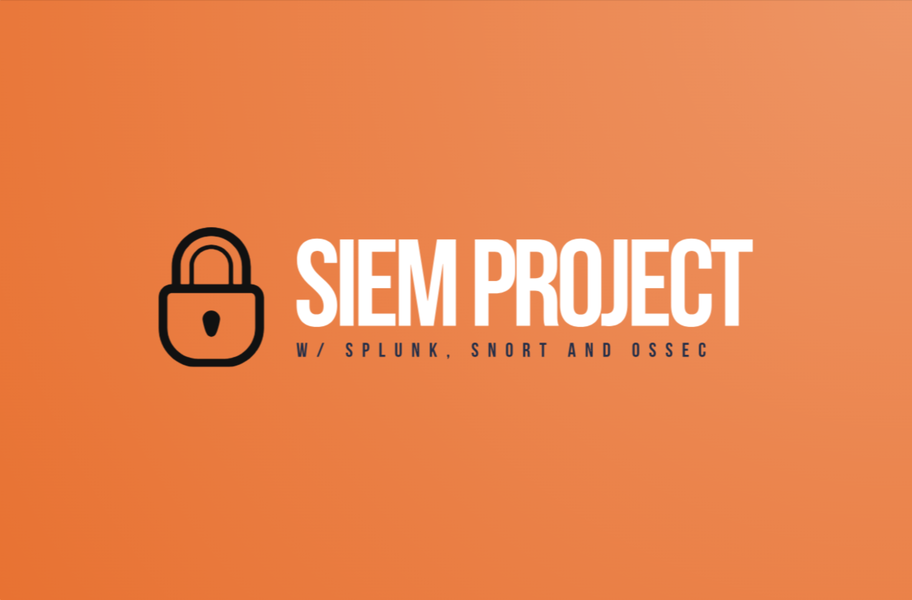
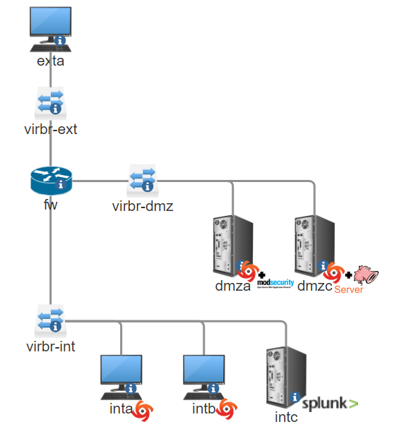
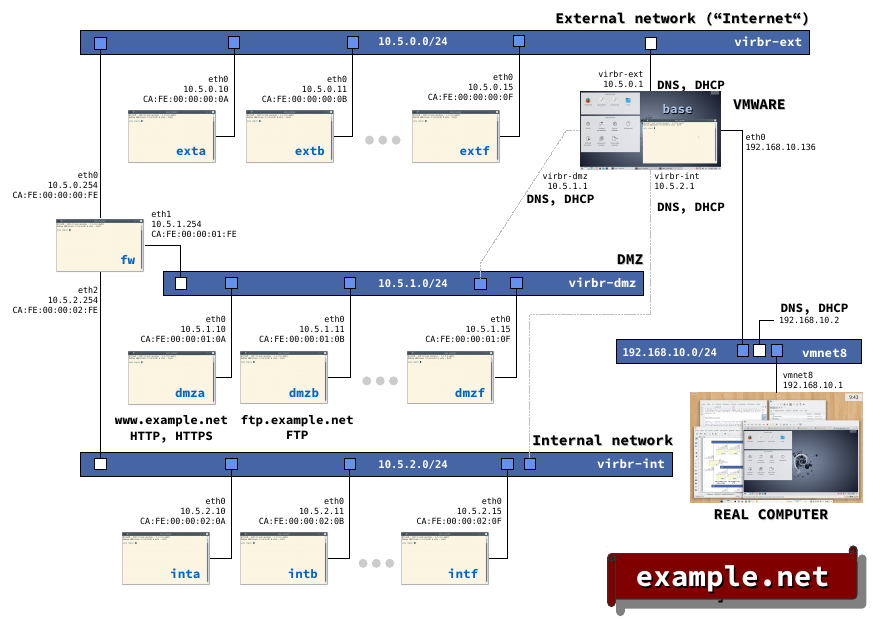
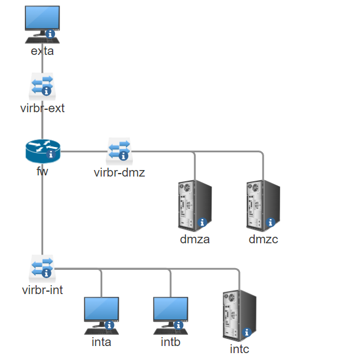

<a id="readme-top"></a>

<!-- PROJECT SHIELDS -->
[![Contributors][contributors-shield]][contributors-url]
[![Forks][forks-shield]][forks-url]
[![Stargazers][stars-shield]][stars-url]
[![Issues][issues-shield]][issues-url]
[![MIT License][license-shield]][license-url]
[![LinkedIn][linkedin-shield]][linkedin-url]

<!-- PROJECT LOGO -->
<br />
<div align="center">
  <a href="https://github.com/vectorete/siem-project-splunk-snort-ossec">
    
  </a>
  <h3 align="center">SIEM Project with Splunk, Snort and Ossec</h3>

  <p align="center">
    This project aims to establish a robust security monitoring laboratory to analyze and respond to various security incidents using tools like Splunk Enterprise, Splunk Universal Forwarder, Snort, and TestmyNIDS within a controlled environment. The lab will also utilize NETinVM for its virtualization capabilities, providing a flexible and isolated testing ground.
    <br />
    <a href="https://github.com/vectorete/siem-project-splunk-snort-ossec"><strong>Explore the docs »</strong></a>
    <br />
    <br />
    <a href="https://github.com/vectorete/siem-project-splunk-snort-ossec">View Demo</a>
    ·
    <a href="https://github.com/vectorete/siem-project-splunk-snort-ossec/issues/new?labels=bug&template=bug-report---.md">Report Bug</a>
    ·
    <a href="https://github.com/vectorete/siem-project-splunk-snort-ossec/issues/new?labels=enhancement&template=feature-request---.md">Request Feature</a>
  </p>
</div>

<!-- TABLE OF CONTENTS -->
<details>
  <summary>Table of Contents</summary>
  <ol>
    <li>
      <a href="#about-the-project">🔎 About The Project</a>
      <ul>
        <li><a href="#objectives">🎯 Objectives</a></li>
        <li><a href="#features">✨ Features</a></li>
        <li>
          <a href="#environment">💿 Environment</a>
          <ul>
            <li><a href="#netinvm">💻 NETinVM</a></li>
            <li><a href="#tools">🧰 Tools</a></li>
          </ul>
        </li>
        <li><a href="#topology">🖧 Topology</a></li>
        <li><a href="#config-note">📁 Configuration Note </a></li>
      </ul>
    </li>
    <li>
      <a href="#getting-started">🚀 Getting Started</a>
      <ul>
        <li><a href="#prerequisites">📝 Prerequisites</a></li>
        <li><a href="#installation">📥 Installation</a></li>
        <li><a href="#testing">🔬 Testing and Validation</a></li>
        <li><a href="#possible-improvements">🔧 Possible Improvements</a></li>
      </ul>
    </li>
    <li><a href="#resources">📚 Resources</a></li>
    <li><a href="#contributing">🤝 Contributing</a></li>
    <li><a href="#license">©️ License</a></li>
    <li><a href="#contact">☎️ Contact</a></li>
  </ol>
</details>

<!-- ABOUT THE PROJECT -->
## 🔎 About The Project <a id="about-the-project"></a>
<div align="center">
  <a href="https://github.com/vectorete/siem-project-splunk-snort-ossec">
    
  </a>
</div>
  <p align="justify">
    This project was conceived for the purpose of investigating in detail, how a Security Information and Event Management (SIEM) system works with regards to the processes that one would need to carry out in order to build one from scratch. In this project, I used Snort, as the network intruder detection system (NIDS); OSSEC, as the host intrusion detection system (HIDS); and central log management with Splunk. The setup of the configuration settings of these applications was usually not well clarified by available internet resources which made me want to come up with my own how-to manual. The purpose of this guide is to create an interesting laboratory in order to imitate a professional SIEM with a well documented guide, as the technical documentation of the tools used is not the most comprehensive.
  </p>
<p align="right">(<a href="#readme-top">back to top</a>)</p>

### 🎯 Objectives <a id="objectives"></a>
- **Centralised Log Management:** Forward logs from several systems to Splunk Enterprise for immediate analysis.
- **Intrusion Detection:** To monitor network traffic, utilise Snort as a Network Intrusion Detection System (NIDS). Additionally, protect every system in your organization's network with OSSEC, a Host Intrusion Detection System (HIDS).
- **Web Application Security:** To protect an Apache Web Server from common internet threats, use ModSecurity, a Web Application Firewall(WAF).
- **Incident Response Automation:** Use Splunk SOAR to automate incident response operations.

<p align="right">(<a href="#readme-top">back to top</a>)</p>

### ✨ Features <a id="features"></a>
1. **Complete SIEM Configuration**:
Integrates Splunk (log management), Snort (NIDS), and OSSEC (HIDS) to provide a comprehensive security monitoring solution.

2. **Practical Configuration Guide**:
Fills up frequent documentation gaps by offering thorough, detailed instructions to configure each tool.

3. **Real-Time Monitoring**:
Real-time alerts and active response to anomalous behaviours with the use of Snort for network-based intrusion detection and OSSEC for host-based monitoring.

4. **Centralised Log Management**:
Offers a consolidated, configurable overview of security events by combining and analysing logs from various sources using Splunk.

5. **ModSecurity Integration**:
Implementing ModSecurity module, a Web Application Firewall (WAF), in the Apache web server in order to improve the security against web threats.

6. **Testing Capabilities**:
Testing the intrusion detection systems (IDS) detection and active response with multiple tests, consisting of: TestmyNIDS script, brute force, and web pentesting.

7. **Customisable Environment**:
Configured in a controlled virtual environment (NETinVM), enabling experimentation and simple adjustments without interfering with operational systems.

8. **Automation and Workflow Orchestration**:
Examines how to automate response to incident processes using Splunk SOAR, hence boosting security operations efficiency.

9. **Educational Resource**:
Offers practical guidance on how to configure your own SIEM, making it a useful tool for professionals and students interested in.

10. **Visual Documentation**:
Showcases configurations and the functionality of the system with screenshots and logs.

<p align="right">(<a href="#readme-top">back to top</a>)</p>

### 💿 Environment <a id="environment"></a>
#### 💻 NETinVM <a id="netinvm"></a>
NETinVM, a VMWare machine, was selected because of its user-friendly capability to create isolated environments, being perfect for testing and educational purposes, which also doesn't affect actual systems. Being able to host multiple virtual machines allows extensive network simulations, which is essential for this laboratory arrangement, notably employing a 3-legged DMZ network design.
  - **Network Topology**:
<div align="center">
    <a href="https://github.com/vectorete/siem-project-splunk-snort-ossec">
      
    </a>
</div>

<p align="right">(<a href="#readme-top">back to top</a>)</p>

#### 🧰 Tools <a id="tools"></a>
- **Splunk Enterprise:** Splunk Enterprise is a powerful software for log management and analysis which collects and indexes data from multiple sources while providing effective searching, monitoring, and alerting. Also Splunk along with QRadar are the two most valued professional tools to achieve this feature, although Splunk has more significance as it's developed by Cisco.

- **Splunk Universal Forwarder:** Splunk Universal Forwarder is necessary to forward the log files, that we want to monitor on remote devices, into the Splunk Enterprise Platform.

- **Snort:** Snort is a popular open-source software network traffic analyzer in real-time relying on rulesets that you can create with the objective generate alerts or block traffic when a rule is triggered. It can operate as a Network Intrusion Detection System(NIDS) or as Network Intrusion Prevention System(NIPS) depending on the configuration. I will be configuring Snort as an NIDS since it will not bottleneck the network traffic, potentially permitting malicious traffic, entering the network at first, but it will be dealt with OSSEC, the Host Intrusion Detection System(HIDS), executed on each machine. Suricata is, personally, a superior option, however Snort has more importance and is also developed by Cisco.

- **OSSEC:** OSSEC is an open-source Host Intrusion Detection System(HIDS) providing log analysis, intrusion detection, and real-time alerts. It helps monitor host systems for unusual activity. In this scenario, we will be installing it on each machine to monitor them.

- **ModSecurity:** ModSecurity is an open-source Web Application Firewall (WAF) that integrates with web servers to protect websites against common threats. We are going to use the ModSecurity module to protect our Apache Web Server.

- **TestmyNIDS:** TestmyNIDS is a script, from a Github project, that tests the reliability of Intrusion Detection Systems (IDS) by simulating various attack scenarios. This will be important for testing the configuration of Snort and assuring it detects threats as expected.

<p align="right">(<a href="#readme-top">back to top</a>)</p>

### 🖧 Topology <a id="topology"></a>
<div align="center">
  <a href="https://github.com/vectorete/siem-project-splunk-snort-ossec">
    
  </a>
</div>

#### **1. DMZ (Demilitarized Zone):** 
  - **`dmza` (Web Server + WAF + OSSEC):**
    - **Web Server:** Located in the DMZ to deal with incoming web traffic. The Web Application Firewall (WAF) adds an additional level of security against common web-based risks (e.g., SQL injection, XSS).
    - **OSSEC:** Acts as a Host Intrusion Detection System (HIDS) for the web server, keeping track of file integrity, log events, and preventing unauthorised access attempts.

  - **`dmzc` (OSSEC Server + Snort NIDS):**
    - **Snort NIDS:** Deployed as a Network Intrusion Detection System (NIDS) inside the DMZ, inspecting traffic between the external network and the DMZ, and also internal communication within DMZ segments. It changes firewall rules dynamically (e.g., via iptables) to block or allow traffic based on threat detection.
    - **OSSEC Server:** Centralised control and evaluation of all OSSEC agents, including the one located in the DMZ (`dmza`) and internal network (`inta`, `intb`). The OSSEC server gathers logs, evaluates rules, and forwards log data to Splunk.

#### **2. Internal Network:**
  - **`inta`, `intb` (OSSEC):**
    - **OSSEC:** Provides HIDS for internal servers or workstations, monitoring for illegal access, malware, and other dangers. Logs from these internal systems are delivered to Splunk for correlation and analysis.

  - **`intc` (Splunk):**
    - **Splunk:** Gathers and processes logs from Snort, OSSEC, and other network devices (via the Universal Forwarder). It delivers an overall overview of security events throughout your whole infrastructure.

#### **3. External Network - Attacker (`exta`):**
   - **Threat Source:** Represents outside threats seeking to break into your network security. Snort in `dmzc` will identify and potentially stop these attempts, while the WAF in `dmza` defends the web server from web-specific attacks. Also these devices are also protected by Ossec(HIDS).

<p align="right">(<a href="#readme-top">back to top</a>)</p>

### 📁 Configuration Note <a id="config-note"></a>
- There is a configuration guide included in the project repository named `GUIDE.md` that details the procedure to configure the whole system in order to manage a secure system with a SIEM structure.

**Important Note**:
- The guide contains the whole system configuration with the respective improvements.
- The laboratory was configured in a Debian system, which is not compatible with Splunk SOAR. It is recommended to use Red Hat Enterprise Linux 8; check the <a href="https://docs.splunk.com/Documentation/SOARonprem/6.2.2/Install/Requirements">requirements</a>. Also, if you change the operating system, make sure to install the listed dependencies (it may be different in other operating systems).
- The performance may not be enough to uphold all the running services, so make sure to assign proper resources to the environment where it will be configured.
- It is not recommended to have the NIDS running on the same machine as the HIDS server, as it may end up being a resource hindrance; here it was configured just to keep it simple and easy to configure.

<p align="right">(<a href="#readme-top">back to top</a>)</p>

<!-- GETTING STARTED -->
## 🚀 Getting Started <a id="getting-started"></a>

To configure the environment, follow `GUIDE.md`. This section will be a summary of the steps that must be done.

### 📝 Prerequisites <a id="prerequisites"></a>

* VMWare with NetinVM (If you choose another one, some commands to install dependencies may vary, but if you want to use a real environment, use Red Hat Linux 8 to ensure compatibility with Splunk SOAR).
* Resources (it is recommended to have at least a PC with SSD + 12 GB of RAM + 6 cores).
* Splunk Account (Register [here](https://idp.login.splunk.com/signin/register) to be able to take the free trial).


### 📥 Installation <a id="installation"></a>
1. **Download VMware**:
    - Download it from the [Website](https://support.broadcom.com/group/ecx/productdownloads?subfamily=VMware+Workstation+Pro); you will need an account.
2. **Download NETinVM and add the Virtual Machine to VMware**:
    ```bash
    wget https://informatica.uv.es/~carlos/ns/netinvm/netinvm_2022-12-29_vmware.zip
    ```
3. **Follow up the guide file**:
    - [GUIDE.md](GUIDE.md)
    - **Splunk Enterprise:**
      1. Download Splunk Enterprise from the official website.
      2. Follow the installation guide to set up on the designated server.
    - **Snort:**
      1. Install Snort on the designated network host.
      2. Configure Snort rules for effective monitoring.
    - **OSSEC:**
      1. Install OSSEC on each machine.
      2. In the desired server, set it up as a server.
      3. In the rest of the machines, set them up as agents.
      4. Create a user with a unique ID in the OSSEC server for each agent.
      5. Import the keys from the server to each respective agent.
    - **Splunk Universal Forwarder:**
      1. Create a Splunk user and group for log forwarding.
      2. Set up the installation directory and download the Universal Forwarder package.
      3. Install the package and configure log forwarding.
      4. Specify which files have to be monitored in `inputs.conf`.
      5. Configure firewall rules to allow traffic on port 9997. 
    - **Apache Web Server with ModSecurity:**
      1. Install Apache and ModSecurity on the web server (you could host DVWA on Apache to test most web attacks).
      2. Configure ModSecurity with recommended settings and rules to protect against XSS, SQL injection, and other attacks.
    - **Splunk SOAR:**
      1. Follow the Splunk documentation to install SOAR (note: not on Debian).
      2. Download the Splunk App for SOAR Export to integrate with Splunk Enterprise.

It's a long configuration if you don't have clear what you have to do, but with the guide, it will be enough to configure it in a fast and straightforward way.

<p align="right">(<a href="#readme-top">back to top</a>)</p>

### 🔬 Testing and Validation <a id="testing"></a>
- **Vulnerability Testing:** Use DVWA (Damn Vulnerable Web Application) to test web application security measures.
- **NIDS Testing:** Use the [TestmyNIDS](https://github.com/3CORESec/testmynids.org) script to test our Network Intrusion Detection System.
- **HIDS Testing:** Attempt failed SSH attempts and brute force attacks to trigger OSSEC.
- **Monitoring Log Outputs:** Analyse logs generated during testing, especially focusing on alerts triggered by ModSecurity and Snort.
- **Incident Response Automation:** Test incident response workflows using Splunk SOAR in response to simulated attacks.

<p align="right">(<a href="#readme-top">back to top</a>)</p>

### 🔧 Possible Improvements <a id="possible-improvements"></a>
#### Security Orchestration Automation and Response (SOAR)
To enhance the functionality of the project, consider integrating **Splunk SOAR**. Splunk SOAR can be used to orchestrate workflows that automate incident responses and analyse data related to specific security events and incidents. For detailed installation and integration instructions, refer to the guide.

#### Antivirus
Deploying an antivirus solution on each machine can further strengthen security by providing an additional security layer with real-time threat detection and prevention. Complementing the SIEM's logging and alerting capabilities, we will have proactive and reactive measures against malware.

For Windows, it is recommended Microsoft Defender, which has greatly improved over the past few years, evolving from a basic antivirus solution to a complete endpoint protection tool.

For Linux, it is recommended Sophos Endpoint, which has robust features, a low system footprint, and integration with central management consoles.

---
#### Snort Improvements
##### 1. PulledPork3:
Utilising PulledPork3 can improve Snort3 rule management. For installation and configuration details, including how to use Emerging Threat rules, please consult the guide.

##### 2. OpenAppID:
Implementing OpenAppID can enable Snort to detect applications like Facebook and Reddit within the network. For setup instructions and configuration steps, refer to the guide.

##### 3.Emerging Threats Rules:
The website [Emerging Threats](https://rules.emergingthreats.net) provides excellent rules for emerging threats, supplied by ProofPoint. These rules are compatible with various systems, including NIDS/NIPS (like Suricata and Snort) and firewalls (such as iptables, PF, PIX, and IPF).

Additionally, Snort rules need to be converted to Snort 3 format using the command:
```bash
snort2lua -c in.rules -r out.rules
```
    
Incorporating these improvements can significantly enhance the detection capabilities of your Snort installation and the overall effectiveness, making it more effective as a Security Operations Centre (SOC).

<p align="right">(<a href="#readme-top">back to top</a>)</p>

<!-- RESOURCES -->
## 📚 Resources <a id="resources"></a>

Here are some additional resources that you may find useful:

### 🗃️ Documentation and Tools
- **[Splunk](https://www.splunk.com)**: The most professional software to search, monitor, and analyse log data. Widely used for log management and operational intelligence.
- **[OSSEC](https://www.ossec.net)**: Open-source Host Intrusion Detection System (HIDS) that provides log analysis, file integrity checking, and real-time alerts.
- **[Snort](https://www.snort.org)**: Open-source Network Intrusion Detection System (NIDS) that inspects real-time traffic to detect and prevent attacks.
- **[NETinVM](https://informatica.uv.es/~carlos/docencia/netinvm/)**: Pre-configured virtual machine environment with a set of multiple virtual machines in a 3-legged dmz network topology.
- **[ModSecurity](https://modsecurity.org)**: Open source, cross-platform web application firewall (WAF) module.
- **[TestmyNIDS](https://github.com/3CORESec/testmynids.org)**: Github script that tests the reliability of your NIDS.
- **[Emerging Threats](https://rules.emergingthreats.net)**: Provides reliable rules for emerging threats, which are compatible with various NIDS/NIPS and firewalls.

### ✅ Security Best Practices
- **[OWASP (Open Web Application Security Project)](https://owasp.org)**: Best resource for web application security and best practices.
- **[NIST Cybersecurity Framework](https://www.nist.gov/cyberframework)**: Guidelines and best cybersecurity practices to improve the overall security.

### 🆘 Community and Support
- **[Splunk Community](https://community.splunk.com)**: Forum to discuss questions related to Splunk products and services.
- **[Snort Users Mailing List](https://www.snort.org/community)**: Mailing list to share information, ask questions, and support related to Snort.
- **[Reddit r/netsec](https://www.reddit.com/r/netsec)**: Subreddit for discussions about network security, news, and multiple resources.
- **[Stack Overflow](https://stackoverflow.com/questions/tagged/security)**: Q&A site for programming and security-related questions.

<p align="right">(<a href="#readme-top">back to top</a>)</p>

<!-- CONTRIBUTING -->
## 🤝 Contributing <a id="contributing"></a>
Contributions are what make the open-source community such an amazing place to learn, inspire, and create. Any contributions you make are **greatly appreciated**.

1. Fork the Project
2. Create your Feature Branch (`git checkout -b feature/AmazingFeature`)
3. Commit your Changes (`git commit -m 'Add some AmazingFeature'`)
4. Push to the Branch (`git push origin feature/AmazingFeature`)
5. Open a Pull Request

<p align="right">(<a href="#readme-top">back to top</a>)</p>

<!-- LICENSE -->
## ©️ License <a id="license"></a>
Distributed under the MIT License. See `LICENSE` for more information.

<p align="right">(<a href="#readme-top">back to top</a>)</p>

<!-- CONTACT -->
## ☎️ Contact <a id="contact"></a>
Victor Kravchuk Vorkevych - victorkravchuk19@gmail.com

Project Link: [https://github.com/vectorete/siem-project-splunk-snort-ossec](https://github.com/vectorete/siem-project-splunk-snort-ossec)

<p align="right">(<a href="#readme-top">back to top</a>)</p>

<!-- MARKDOWN LINKS & IMAGES -->
<!-- https://www.markdownguide.org/basic-syntax/#reference-style-links -->
[contributors-shield]: https://img.shields.io/github/contributors/vectorete/siem-project-splunk-snort-ossec.svg?style=for-the-badge
[contributors-url]: https://github.com/vectorete/siem-project-splunk-snort-ossec/graphs/contributors
[forks-shield]: https://img.shields.io/github/forks/vectorete/siem-project-splunk-snort-ossec.svg?style=for-the-badge
[forks-url]: https://github.com/vectorete/siem-project-splunk-snort-ossec/network/members
[stars-shield]: https://img.shields.io/github/stars/vectorete/siem-project-splunk-snort-ossec.svg?style=for-the-badge
[stars-url]: https://github.com/vectorete/siem-project-splunk-snort-ossec/stargazers
[issues-shield]: https://img.shields.io/github/issues/vectorete/siem-project-splunk-snort-ossec.svg?style=for-the-badge
[issues-url]: https://github.com/vectorete/siem-project-splunk-snort-ossec/issues
[license-shield]: https://img.shields.io/github/license/vectorete/siem-project-splunk-snort-ossec.svg?style=for-the-badge
[license-url]: https://github.com/vectorete/siem-project-splunk-snort-ossec/blob/master/LICENSE.txt
[linkedin-shield]: https://img.shields.io/badge/-LinkedIn-black.svg?style=for-the-badge&logo=linkedin&colorB=555
[linkedin-url]: https://linkedin.com/in/victorkvor
